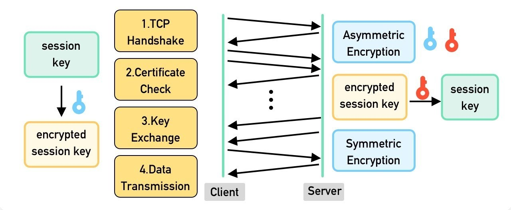

## 4. HTTP/HTTPS:

### 4.1. HTTP (HyperText Transfer Protocol)

- **Definition**: A communication protocol for transferring data (HTML, JSON, files, etc.) between **client (browser, app)** and **server**.
- **Stateless**: Each request is independent; server doesn’t “remember” previous requests (unless we use sessions, cookies, or tokens).
- **Layer**: Works on **Application Layer** (OSI model) and usually runs on **TCP (port 80)**.

#### 4.1.1. HTTP Request/Response

A request has:

- **Method** (what the client wants to do):

  - `GET` – retrieve data
  - `POST` – send data (like form submission)
  - `PUT` – update/replace data
  - `PATCH` – partially update data
  - `DELETE` – remove data
  - `HEAD` – like GET but only headers (no body)
  - `OPTIONS` – ask the server which methods are supported

- **Headers** → Metadata (e.g., Content-Type, Authorization).
- **Body** → Data (for POST/PUT, e.g., JSON).

A response has:

- **Status code**:

  - `200 OK` → success.
  - `404 Not Found`.
  - `500 Internal Server Error`.

- **Headers** → Metadata (e.g., Content-Length).
- **Body** → HTML, JSON, or file.

#### **4.1.2. Common status code**

---

##### **1xx — Informational**

Used to indicate that the request was received and is continuing to be processed.

| Code                        | Meaning          | Description                                                |
| --------------------------- | ---------------- | ---------------------------------------------------------- |
| **100 Continue**            | Request received | The client should continue with its request.               |
| **101 Switching Protocols** | Protocol change  | Server agrees to switch protocols (e.g. HTTP → WebSocket). |

---

##### **2xx — Success**

Means the request was successfully received, understood, and accepted.

| Code               | Meaning                   | Description                                      |
| ------------------ | ------------------------- | ------------------------------------------------ |
| **200 OK**         | Success                   | Standard response for successful HTTP requests.  |
| **201 Created**    | Resource created          | The request created a new resource (e.g., POST). |
| **202 Accepted**   | Processing                | Request accepted but not yet completed.          |
| **204 No Content** | Success, no response body | Often used with DELETE requests.                 |

---

##### **3xx — Redirection**

Indicates that further action must be taken to complete the request.

| Code                       | Meaning                                | Description                                    |
| -------------------------- | -------------------------------------- | ---------------------------------------------- |
| **301 Moved Permanently**  | Permanent redirect                     | Resource moved to a new URL permanently.       |
| **302 Found**              | Temporary redirect                     | Resource temporarily available at another URL. |
| **304 Not Modified**       | Cached response                        | Client can use cached version (no changes).    |
| **307 Temporary Redirect** | Like 302 but preserves request method. |                                                |
| **308 Permanent Redirect** | Like 301 but preserves request method. |                                                |

---

##### **4xx — Client Error**

Indicates that the client made an error (invalid request, unauthorized, etc.).

| Code                           | Meaning                      | Description                                                      |
| ------------------------------ | ---------------------------- | ---------------------------------------------------------------- |
| **400 Bad Request**            | Invalid syntax               | The server cannot process the request due to bad input.          |
| **401 Unauthorized**           | Authentication required      | The client must authenticate to get the requested response.      |
| **403 Forbidden**              | Access denied                | The server understands the request but refuses to authorize it.  |
| **404 Not Found**              | Resource not found           | The requested resource does not exist.                           |
| **405 Method Not Allowed**     | Invalid HTTP method          | The method is not supported by the resource.                     |
| **409 Conflict**               | Conflict with current state  | Typically when updating a resource with conflicting data.        |
| **410 Gone**                   | Resource permanently deleted | The resource is no longer available.                             |
| **415 Unsupported Media Type** | Invalid content type         | The server refuses the request because of an unsupported format. |
| **429 Too Many Requests**      | Rate limiting                | The user has sent too many requests in a given time.             |

---

##### **5xx — Server Error**

The request was valid, but the server failed to fulfill it.

| Code                               | Meaning                        | Description                                                  |
| ---------------------------------- | ------------------------------ | ------------------------------------------------------------ |
| **500 Internal Server Error**      | Generic server error           | The server encountered an unexpected condition.              |
| **501 Not Implemented**            | Unsupported functionality      | The server doesn’t support the requested method.             |
| **502 Bad Gateway**                | Invalid response from upstream | The server received an invalid response from another server. |
| **503 Service Unavailable**        | Temporarily overloaded         | The server is down or overloaded.                            |
| **504 Gateway Timeout**            | Timeout from upstream          | The upstream server failed to send a response in time.       |
| **505 HTTP Version Not Supported** | Unsupported HTTP version       | The server doesn’t support the HTTP protocol version used.   |

---

### 4.2. HTTPS (HTTP Secure)

- **Definition**: HTTP + **TLS/SSL encryption** → Secure communication.
- **Port**: Runs on **TCP 443**.
- **Why?**

  - Encrypts data (prevents sniffing).
  - Authentication (server identity verified by SSL certificate).
  - Integrity (detects tampering).

#### 4.2.1 How HTTPS Works

1. **Handshake**: Client and server exchange keys using TLS.
2. **Encryption**: Communication is encrypted with symmetric keys.
3. **Certificates**: Server presents a digital certificate (issued by Certificate Authority).

   - Browser checks if it’s valid.
   - If valid → secure lock in browser.

4. **Key Exchange**:

- The client generates a random session key (used for faster symmetric encryption).
- This key is encrypted with the server’s public key (asymmetric encryption) and sent to the server.
- Only the server can decrypt it using its private key.

5. **Data Transmission**:

- Now both sides have the same session key.
- They switch to symmetric encryption (AES, ChaCha20, etc.) because it’s much faster for actual data transfer.



### 4.2.2. **TLS/SSL Basics**

- **SSL (Secure Sockets Layer):** The original protocol for encrypting internet traffic (obsolete but still commonly used).
- **TLS (Transport Layer Security):** The modern, secure successor to SSL (what’s actually used today).

When people say “SSL certificate,” they usually mean **TLS certificate**.

#### 4.2.2.1. **What TLS/SSL Does**

1. **Encryption** – Scrambles data so only the intended recipient can read it.

   - Prevents attackers from sniffing sensitive info (e.g., passwords, credit card numbers).

2. **Authentication** – Uses digital certificates to prove the server is who it claims to be.

   - Example: When you connect to `https://google.com`, TLS ensures you’re really talking to Google, not an attacker.

3. **Integrity** – Ensures data isn’t modified in transit.

   - If a hacker tries to tamper with packets, TLS detects it.

#### 4.2.2.2. **How TLS/SSL Works (Simplified)**

1. **Client Hello** – Browser says: “I want to connect securely. Here are encryption methods I support.”
2. **Server Hello** – Server replies with its certificate (proves its identity) + picks an encryption method.
3. **Key Exchange** – Client and server agree on a **session key** (used to encrypt the session).
4. **Secure Communication** – All further HTTP messages are encrypted with the session key.

#### 4.2.2.3. Why TLS/SSL is Critical for Backend Dev

- All modern APIs and web apps **must** use HTTPS (with TLS).
- Required for compliance (GDPR, PCI-DSS, etc.).
- Browsers mark HTTP-only sites as **“Not Secure”**.

#### 4.2.2.4. Summary

- Definition: Encryption protocols used to secure communication over the Internet.
- Purpose: By encrypting data transmitted between a client (computer/browser) and a server, they prevent third parties from eavesdropping or tampering with the data.
- Key Benefits:

  - Confidentiality – keeps data private.
  - Integrity – prevents modification during transmission.
  - Authentication – ensures the server (and sometimes the client) is the real one.

- Together, they provide **encryption + authentication + integrity** for HTTPS.

#### 4.2.3. Example (as a backend dev)

- You build a REST API:

  - **Without HTTPS** → Requests are plain text. A hacker on the same Wi-Fi can see:

    ```https
    GET /login?username=admin&password=1234
    ```

  - **With HTTPS** → All requests & responses are encrypted; attacker sees gibberish.

### 4.3 Key HTTP/HTTPS Concepts (Summary)

**Summary**

- HTTP (HyperText Transfer Protocol):

  - A protocol used for transferring data (web pages, APIs) between client (browser/app) and server.
  - Runs on port 80 by default.
  - Data is not encrypted → vulnerable to sniffing and attacks.

- HTTPS (HyperText Transfer Protocol Secure):
  - Secure version of HTTP, using TLS/SSL encryption.
  - Runs on port 443 by default.
  - Ensures confidentiality, integrity, and authentication of data.

Both are the foundation of web communication, but HTTPS is the modern standard because of security.

- **Idempotency**: `GET` is safe (doesn’t change state), `POST` is not.
- **REST API**: Uses HTTP verbs (`GET, POST, PUT, DELETE`) to manage resources.
- **CORS**: Security mechanism controlling cross-origin requests.
- **Cookies / Sessions / JWT**: Used to keep state on top of HTTP.
- **HTTP/2, HTTP/3**: Faster versions of HTTP with multiplexing and lower latency.

| Feature     | HTTP                    | HTTPS                   |
| ----------- | ----------------------- | ----------------------- |
| Port        | 80                      | 443                     |
| Security    | No encryption           | Encrypted (TLS/SSL)     |
| Use case    | Old / test environments | Production, secure APIs |
| Example URL | `http://example.com`    | `https://example.com`   |
