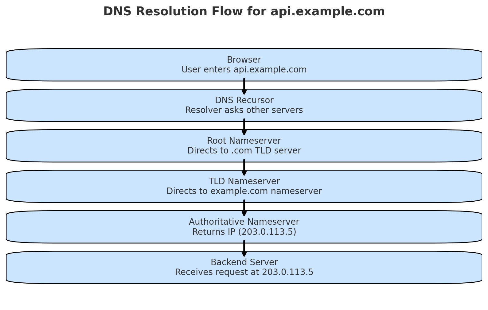
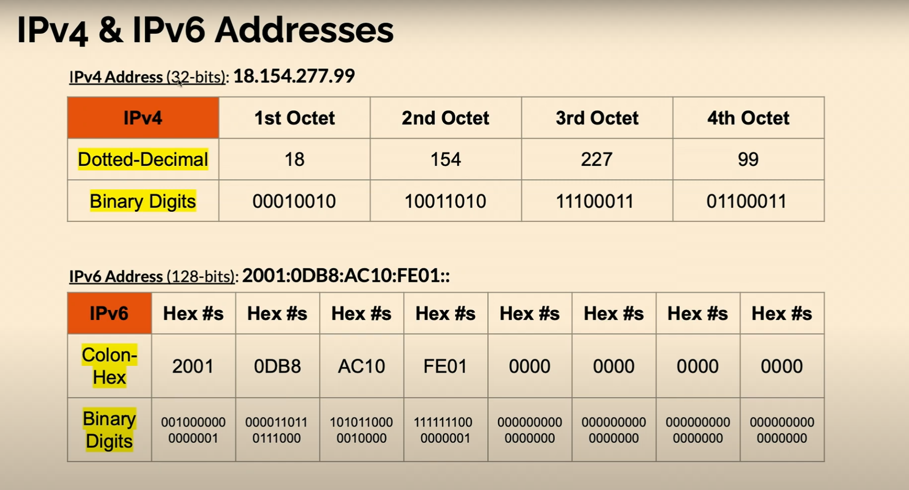
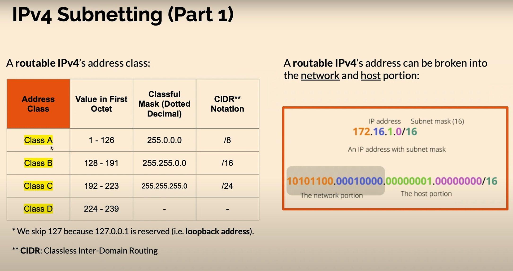
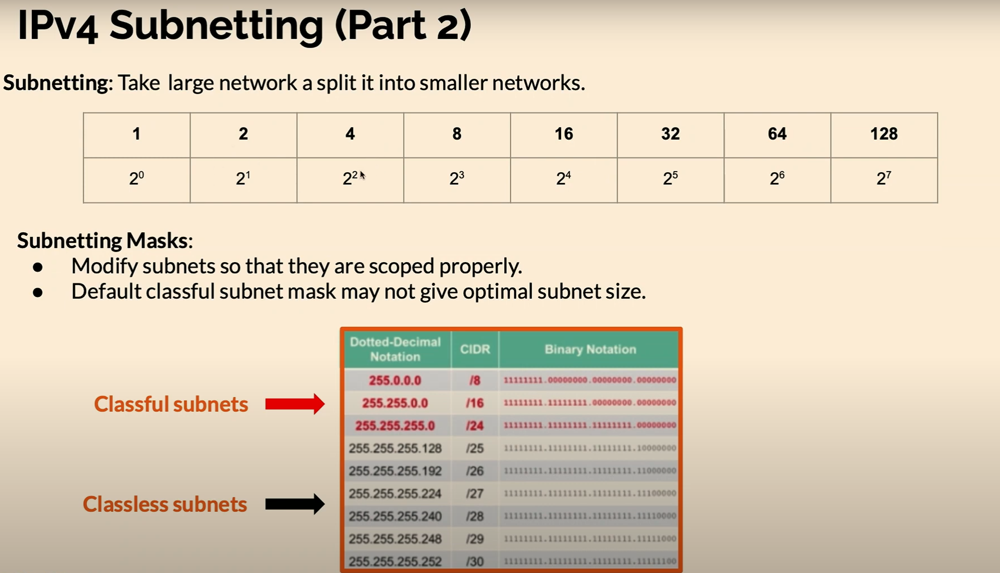

# Basic web concepts

# Note for learning basic networking

# Table of contents

- [Basic web concepts](#basic-web-concepts)
- [Note for learning basic networking](#note-for-learning-basic-networking)
- [Table of contents](#table-of-contents)
- [0. Introduction flow:](#0-introduction-flow)
- [1. DNS (Domain Name System)](#1-dns-domain-name-system)
  - [1.1. What is DNS?](#11-what-is-dns)
  - [1.2. The 4 DNS Servers in web loading](#12-the-4-dns-servers-in-web-loading)
    - [1.2.1. DNS Recursor (or DNS Resolver)](#121-dns-recursor-or-dns-resolver)
    - [1.2.2. Root Nameserver](#122-root-nameserver)
    - [1.2.3. TLD Nameserver](#123-tld-nameserver)
    - [1.2.4. Authoritative Nameserver](#124-authoritative-nameserver)
  - [1.3. How a DNS Query Works](#13-how-a-dns-query-works)
  - [1.4. DNS records](#14-dns-records)
  - [1.5. Summary:](#15-summary)
- [2. OSI Model -\> TCP/IP Model (TCP/IP focused)](#2-osi-model---tcpip-model-tcpip-focused)
  - [2.1. Introduction: What is TCP/IP?](#21-introduction-what-is-tcpip)
    - [2.2. Application Layer (OSI: Application + Presentation + Session → TCP/IP: Application)](#22-application-layer-osi-application--presentation--session--tcpip-application)
    - [2.3. Transport Layer (OSI: Transport → TCP/IP: Transport)](#23-transport-layer-osi-transport--tcpip-transport)
    - [2.4. Network Layer (OSI: Network → TCP/IP: Internet)](#24-network-layer-osi-network--tcpip-internet)
    - [2.5. Link/Physical Layers (OSI: Data Link + Physical → TCP/IP: Network Interface)](#25-linkphysical-layers-osi-data-link--physical--tcpip-network-interface)
    - [2.6. Summary and example](#26-summary-and-example)
- [3. IP Address](#3-ip-address)
  - [3.1. What is an IP Address ?](#31-what-is-an-ip-address-)
  - [3.2. **Ipv4 vs Ipv6**](#32-ipv4-vs-ipv6)
  - [3.3. Public vs Private IP](#33-public-vs-private-ip)
  - [3.4. Static vs Dynamic IP](#34-static-vs-dynamic-ip)
  - [**3.5. Subnetting**](#35-subnetting)
    - [3.5.1. IP Address Structure](#351-ip-address-structure)
    - [3.5.2. Subnet Mask](#352-subnet-mask)
  - [3.6. Key Formulas and Backend Dev Relevance](#36-key-formulas-and-backend-dev-relevance)
  - [3.7. Summary and example](#37-summary-and-example)
- [4. HTTP/HTTPS:](#4-httphttps)
  - [4.1. HTTP (HyperText Transfer Protocol)](#41-http-hypertext-transfer-protocol)
    - [4.1.1. HTTP Request/Response](#411-http-requestresponse)
  - [4.2. HTTPS (HTTP Secure)](#42-https-http-secure)
    - [4.2.1 How HTTPS Works](#421-how-https-works)
    - [4.2.2. Example (as a backend dev)](#422-example-as-a-backend-dev)
  - [4.3 Key HTTP/HTTPS Concepts (Summary)](#43-key-httphttps-concepts-summary)
- [5.](#5)

# 0. Introduction flow:

```pgsql
You type:  example.com
           |
           v
+------------------+
|   DNS Lookup     |   🔎 "What is the IP of example.com?"
+------------------+
           |
           v
+------------------+
|   TCP/IP Layer   |   📦 Use the IP to establish a connection (TCP handshake)
+------------------+
           |
           v
+------------------+
|   HTTP/HTTPS     |   🌐 Send/receive web data over the TCP connection
+------------------+
```

---

```pgsql
[ You / Browser ]
        |
        | 1. Type "http://example.com"
        v
+-------------------+
|   DNS Resolver    |  <-- asks "What is example.com?"
+-------------------+
        |
        | 2. DNS Query (UDP/TCP 53)
        v
+-------------------+       +---------------------+
| Root DNS Server   | --->  | .com DNS Server     |
+-------------------+       +---------------------+
                                   |
                                   v
                           +---------------------+
                           | example.com DNS     |
                           | -> 93.184.216.34    |
                           +---------------------+

        |
        | 3. DNS Response: IP = 93.184.216.34
        v
[ You / Browser ]
        |
        | 4. Open TCP connection (port 80/443)
        v
+--------------------------------------------------+
|   Web Server at 93.184.216.34                    |
|                                                  |
|   <--- HTTP Request: GET / HTTP/1.1 ------------ |
|   ---> HTTP Response: 200 OK + HTML ------------ |
+--------------------------------------------------+
```

Breakdown:

- DNS: resolves name -> IP.
- TCP/IP: makes sure two machines can talk reliably using that IP.
- HTTP/HTTPs: the actual web protocol to exchange requests & responses.

# 1. DNS (Domain Name System)

## 1.1. What is DNS?

- The Domain Name System (DNS) is the `phonebook of the Internet`.
- Humans access information online through `domain names`, like `nytimes.com` or `espn.com`.
- Web browsers interact through `Internet Protocol (IP) addresses`.
- DNS translates domain names to `IP addresses` so browsers can load Internet resources.

- Each device connected to the Internet has a unique IP address which other machines use to find the device.
- DNS servers eliminate the need for humans to memorize IP addresses such as 192.168.1.1 (in IPv4), or more complex newer alphanumeric IP addresses such as 2400:cb00:2048:1::c629:d7a2 (in IPv6).

## 1.2. The 4 DNS Servers in web loading

### 1.2.1. DNS Recursor (or DNS Resolver)

- First server your device asks; it hunts down the answer by querying others.
- Acts like a middleman: it doesn’t know the answer but knows where to ask.
- Usually provided by your ISP, Google DNS `(8.8.8.8)`, or Cloudflare `(1.1.1.1)`.

### 1.2.2. Root Nameserver

- Knows which `Top-Level Domain (TLD)` server at to contact (e.g: `.com`, `.org`)
- Example: for `example.com`, the root says “ask the `.com` server.”

### 1.2.3. TLD Nameserver

- Stands for top-level domain (TLD) is the final segment of a domain name, appearing after the last dot, such as .com, .org, or .vn.
- Knows which Authoritative server holds the records for the domain.
- Example: `.com` TLD server says “the authoritative server for `example.com` is at X.”

### 1.2.4. Authoritative Nameserver

- Final source of truth; return the actual IP (A/AAAA record, etc).
- Only the authoritative nameserver gives the real IP. The others are just guides along the way.
- Example: “example.com = 93.184.216.34”.

## 1.3. How a DNS Query Works

1. Browser → Resolver

   - User types www.example.com in browser.
   - Browser asks the DNS recursive resolver (e.g., ISP’s resolver or public one like `8.8.8.8`).
   - ISP stands for Internet Service Provider, a company that provides users with access to the internet, acting as a "bridge" between a device and the global network.
   - Resolver checks its cache. If not found → continues the query.

2. Resolver → Root Nameserver (.)

   - Resolver queries the root nameserver.
   - Root replies: “I don’t know the IP, but the `.com` TLD server does.”

3. Resolver → TLD Nameserver (`.com`)

   - Resolver asks the `.com` TLD server.
   - TLD replies: “I don’t have the IP, but here’s the authoritative nameserver for `example.com`.”

4. Resolver → Authoritative Nameserver (example.com)

   - Resolver queries the authoritative server.
   - Authoritative server responds: www.example.com = `93.184.216.34`.

5. Resolver → Browser

   - Resolver caches the result (for faster future lookups).
   - Resolver sends the IP back to the browser.
   - Browser can now connect directly to the web server at `93.184.216.34`.

The browser is able to make the request for the web page:

- The browser makes a HTTP request to the IP address.
- The server at that IP returns the webpage to be rendered in the browser.

**In short**: Browser → Resolver → Root → TLD → Authoritative → Resolver → Browser → Website.




## 1.4. DNS records

| Record    | Purpose                                           | Example                               |
| --------- | ------------------------------------------------- | ------------------------------------- |
| **A**     | Maps hostname → IPv4 address                      | `api.example.com → 192.0.2.1`         |
| **AAAA**  | Maps hostname → IPv6 address                      | `api.example.com → 2001:db8::1`       |
| **CNAME** | Alias (points one name to another)                | `www.example.com → example.com`       |
| **MX**    | Mail servers for a domain                         | `example.com → mail.example.com`      |
| **TXT**   | Arbitrary text (used for SPF, DKIM, verification) | `v=spf1 include:_spf.google.com ~all` |
| **NS**    | Delegates domain to name servers                  | `example.com → ns1.provider.com`      |

## 1.5. Summary:

- DNS = Internet's phonebook
- Purpose: Translates human-readable names (`example.com`) -> machine IP address (e.g: `93.184.216.34`)
- Without DNS -> we would have to memorize IPs instead of names.
- 4 DNS Server in action:
  - Recursive Resolver: first stop, usually your ISP, Google (`8.8.8.8`) or Cloudflare (`1.1.1.1`). Acts as a middleman to find the answer.
  - Root Nameserver (.): Knows which TLD server to ask (e.g: `.com`, `.org`)
  - TLD Nameserver: Knows which authorities server stores the domain's records (e.g: `example.com`)
  - Authoritative Nameserver: The source of truth - returns the real IP (A/AAAA record) (e.g: `www.example.com` = `93.184.216.34`).
- Flow: Browser -> Resolver -> Root -> TLD -> Authoritative -> back to Resolver -> Browser -> Server.

# 2. OSI Model -> TCP/IP Model (TCP/IP focused)


## 2.1. Introduction: What is TCP/IP?

- Protocol Suite: A set of protocols that enable end-to-end communication.
- Network Model: Provides a layered framework for how data flows across networks.
- Foundation of the Internet: Every interaction on the Internet and most private networks relies on TCP/IP.

**TCP (Transmission Control Protocol)**

- Reliable, ordered delivery.
- Handles retransmission, error checking, flow control.
- Used in: HTTP/HTTPS, gRPC, database connections.

**IP (Internet Protocol)**

- Addressing and routing of packets.
- Ensures data gets to the correct device.
- IP = “where to send,” TCP = “how to deliver correctly.”

**How TCP/IP Works**

- Packetization: Application data is split into packets.
- Addressing: Each packet is labeled with source + destination IP addresses.
- Routing: Routers forward packets toward the destination.
- Reliable Delivery (TCP): Packets are reassembled in order, with error checking.

**TCP/IP merges some OSI layers:**

- Application + Presentation + Session → Application
- Data Link + Physical → Network Interface

### 2.2. Application Layer (OSI: Application + Presentation + Session → TCP/IP: Application)

This is the layer you work with the most.

- Work with interfaces, protocols, software.
- Protocols: HTTP/1.1, HTTP/2, HTTP/3, HTTPS, DNS, SMTP, FTP, gRPC, WebSocket.
- This is where APIs live.
- Examples in backend:
  - When you build a REST API, you’re designing at the Application Layer.
  - When your backend calls an external API (e.g., GET /users), that’s also Application Layer.
  - TLS encryption (HTTPS) also belongs here.

As a backend dev, when debugging a failing request, you usually check:

- Headers (Authorization, Content-Type, etc.)
- Response codes (200, 404, 500…)
- Certificates (TLS/SSL)

### 2.3. Transport Layer (OSI: Transport → TCP/IP: Transport)

This layer makes sure data arrives correctly.

- Error-free data delivery between host -> destination nodes.
- Protocols: TCP, UDP.
- TCP:
  - Connection-oriented (3-way handshake: SYN → SYN-ACK → ACK).
  - Reliable (guarantees order & delivery).
  - Used by HTTP, HTTPS, gRPC, database connections.
- UDP:
  - Connectionless, faster, no guarantee of delivery.
  - Used for DNS queries, video streaming, gaming.
- Example for backend:
  - When your API is slow because of many half-open TCP connections → you might hit TIME_WAIT or socket exhaustion.
  - If you deploy a WebSocket or gRPC service, you’re still on TCP.

### 2.4. Network Layer (OSI: Network → TCP/IP: Internet)

This layer decides where the packet goes (routing).

- Package data into IP packets; transmit packets across the network.
- Protocols: IP (IPv4, IPv6), ICMP (ping).
- Key ideas:
  - IP address identifies devices.
  - Routers move packets across networks.
  - TTL (Time To Live) prevents infinite loops.
- Example for backend:
  - When your server can’t reach a database in another subnet → likely a routing issue.
  - When DNS resolves correctly but your request still times out → maybe firewall or routing problem.

### 2.5. Link/Physical Layers (OSI: Data Link + Physical → TCP/IP: Network Interface)

This is about hardware and direct connections.

- Transmit bits across the network
- Examples: Ethernet cables, Wi-Fi, MAC addresses.

As a backend developer, you almost never touch this directly, but it matters when:

- Debugging why a server NIC (network card) is misconfigured.
- Dealing with Docker/Kubernetes networking (bridge, overlay networks).

### 2.6. Summary and example

**SUMMARY**

- TCP/IP = protocol suite + network model → foundation of the Internet.
- TCP (Transmission Control Protocol)
  - Reliable, ordered delivery of data.
  - Handles retransmission, error checking, flow control.
  - Used in: HTTP/HTTPS, APIs, databases.
- IP (Internet Protocol)
  - Handles addressing + routing.
  - Each packet has source + destination IP.
  - IP = “where to send”, TCP = “how to deliver correctly.”
- How it works:
  - Data split into packets.
  - IP adds addressing.
  - Routers forward packets.
  - TCP reassembles + checks integrity.
- TCP/IP vs OSI:
  - OSI (7 layers) → TCP/IP (4 layers).
  - Application (HTTP, DNS), Transport (TCP/UDP), Internet (IP), Network Interface.
- Backend developer view:
  - You mostly touch Application (HTTP, gRPC, DNS),
  - sometimes Transport (TCP vs UDP decisions),
  - and need to understand IP addressing/routing basics.

| **Layer**     | **What You Do as Backend Dev**                           |
| ------------- | -------------------------------------------------------- |
| Application   | Build APIs (HTTP, gRPC, WebSocket), use TLS, DNS lookups |
| Transport     | Handle TCP connections, sockets, connection pooling      |
| Network       | Deal with IPs, routing, firewall rules, VPNs             |
| Link/Physical | Mostly invisible, but relevant in container networking   |

**EXAMPLE:** How a client calls your api

- Application Layer: Browser sends `GET /users request(HTTP).
- Transport Layer: Wrapped in TCP segment, reliable connection established.
- Network Layer: Packet gets destination IP (server's public IP)
- Link/Physical Layer: Transmitted over Ethernet/Wi-Fi until it reaches server.
  When server responds, the flow goes back up the layers to the client.

**EXAMPLE:** TCP Example - REST API / Database

Suppose you build a REST API:

```http
GET /users HTTP/1.1
Host: api.example.com
```

Behind the scenes:

- HTTP request = Application layer.
- Runs on top of TCP (port 443 for HTTPS).
- TCP ensures the request and response arrive in order and intact.
- If one packet is lost, TCP retransmits it.
- Without TCP, your API might return broken JSON (half the response missing).
- Without TCP, Connection pooling in databases (like PostgreSQL/MySQL) is managing TCP sockets.

**EXAMPLE:** UDP Example: DNS Query

- Your backend calls an external API at api.stripe.com.
- Before sending the HTTP request, your server asks DNS:

```csharp
What is the IP of api.stripe.com?
```

- DNS runs on UDP (port 53) → fast, no need for reliability.
- If a packet is lost, client just retries (instead of waiting).

Why it matters?

- If DNS resolution fails, your backend can’t even start the HTTP request.
- This is why misconfigured DNS often causes “server unreachable” errors.

# 3. IP Address

## 3.1. What is an IP Address ?

- Definition: An Internet Protocol (IP) address is a unique identifier for a device on a network.
- Acts like a postal address for computers — tells data where to go and where it came from.
- Written in dot-decimal (IPv4) or colon-hexadecimal (IPv6) form.

## 3.2. **Ipv4 vs Ipv6**



**IPv4 (32-bit)**

- Example: 18.154.227.99
- Format: Dotted-decimal (4 numbers separated by dots).
- Each number = 1 octet (8 bits).
- Example breakdown to bit:
- 18 → 00010010
- 154 → 10011010
- 227 → 11100011
- 99 → 01100011

→ IPv4 = total 32 bits (4 × 8 bits).

Features:

- ~4.3 billion possible addresses.
- Widely used, but running out of addresses.

**IPv6 (128-bit)**

- Example: 2001:0DB8:AC10:FE01::
- Format: Colon-hexadecimal (8 groups of 4 hex digits).
- Each hex digit = 4 bits, so each group = 16 bits.
- Example breakdown to bit:
- 2001 → 0010000000000001
- 0DB8 → 0000110110111000
- AC10 → 1010110000010000
- FE01 → 1111111000000001
- Remaining groups are zeros (compressed as ::).

→ IPv6 = total 128 bits (8 × 16 bits).

Features:

- Almost unlimited addresses (3.4×10³⁸).
- Built to replace IPv4.

## 3.3. Public vs Private IP

**Public IP:**

- Unique across the internet.
- Assigned by ISPs (e.g., 203.0.113.25).
- Used for web servers, APIs, etc.

**Private IP:**

- Used inside local networks (e.g., 192.168.x.x, 10.x.x.x).
- Not directly accessible from the internet.
- Backend devs often configure databases or internal services with private IPs.

## 3.4. Static vs Dynamic IP

- Static IP: Fixed, doesn’t change (used for servers).
- Dynamic IP: Assigned temporarily by DHCP (common for home devices).

## **3.5. Subnetting**

### 3.5.1. IP Address Structure



An IP address has two parts:

- Network ID → Identifies the network.
- Host ID → Identifies a device inside the network.

Example:
`192.168.1.10/24`

- Network part = `192.168.1`
- Host part = `10`
- `/24` = **Subnet Mask length** (24 bits for network, 8 bits for hosts).

### 3.5.2. Subnet Mask



A subnet mask tells us how many bits are for the network and how many for hosts.

Example:

`/24` = `255.255.255.0`

→ Network = first 24 bits.

→ Host = last 8 bits (2⁸ – 2 = 254 usable hosts).

`/16` = `255.255.0.0`

→ 2¹⁶ – 2 = 65,534 hosts.

`/30`= `255.255.255.252`

→ 2² – 2 = 2 usable hosts.

## 3.6. Key Formulas and Backend Dev Relevance

**Key Formulas:**

- Number of hosts per subnet = 2^(host bits) – 2
  (subtract 2 for network address & broadcast address).

- Number of subnets = 2^(borrowed bits).

**Backend Dev Relevance:**

- Deploying apps: Need to know your server’s public IP.
- Connecting to databases: Often use private IPs inside a VPC.
- Scaling apps: Must understand subnetting + routing when setting up clusters.
- Security: Configure firewalls to allow/deny specific IP ranges.

## 3.7. Summary and example

Example of Subnetting

Suppose you have:
`192.168.1.0/24` (256 IP addresses: 0–255).

Split into 2 subnets (/25):

- `192.168.1.0/25` → Hosts: 0–127 (126 usable).
- `192.168.1.128/25` → Hosts: 128–255 (126 usable).

# 4. HTTP/HTTPS:

## 4.1. HTTP (HyperText Transfer Protocol)

- **Definition**: A communication protocol for transferring data (HTML, JSON, files, etc.) between **client (browser, app)** and **server**.
- **Stateless**: Each request is independent; server doesn’t “remember” previous requests (unless we use sessions, cookies, or tokens).
- **Layer**: Works on **Application Layer** (OSI model) and usually runs on **TCP (port 80)**.

### 4.1.1. HTTP Request/Response

A request has:

- **Method** (what the client wants to do):

  - `GET` – retrieve data
  - `POST` – send data (like form submission)
  - `PUT` – update/replace data
  - `PATCH` – partially update data
  - `DELETE` – remove data
  - `HEAD` – like GET but only headers (no body)
  - `OPTIONS` – ask the server which methods are supported

- **Headers** → Metadata (e.g., Content-Type, Authorization).
- **Body** → Data (for POST/PUT, e.g., JSON).

A response has:

- **Status code**:

  - `200 OK` → success.
  - `404 Not Found`.
  - `500 Internal Server Error`.

- **Headers** → Metadata (e.g., Content-Length).
- **Body** → HTML, JSON, or file.

## 4.2. HTTPS (HTTP Secure)

- **Definition**: HTTP + **TLS/SSL encryption** → Secure communication.
- **Port**: Runs on **TCP 443**.
- **Why?**

  - Encrypts data (prevents sniffing).
  - Authentication (server identity verified by SSL certificate).
  - Integrity (detects tampering).

### 4.2.1 How HTTPS Works

1. **Handshake**: Client and server exchange keys using TLS.
2. **Encryption**: Communication is encrypted with symmetric keys.
3. **Certificates**: Server presents a digital certificate (issued by Certificate Authority).

   - Browser checks if it’s valid.
   - If valid → secure lock in browser.

### 4.2.2. Example (as a backend dev)

- You build a REST API:

  - **Without HTTPS** → Requests are plain text. A hacker on the same Wi-Fi can see:

    ```https
    GET /login?username=admin&password=1234
    ```

  - **With HTTPS** → All requests & responses are encrypted; attacker sees gibberish.

## 4.3 Key HTTP/HTTPS Concepts (Summary)

**Summary**

- HTTP (HyperText Transfer Protocol):

  - A protocol used for transferring data (web pages, APIs) between client (browser/app) and server.
  - Runs on port 80 by default.
  - Data is not encrypted → vulnerable to sniffing and attacks.

- HTTPS (HyperText Transfer Protocol Secure):
  - Secure version of HTTP, using TLS/SSL encryption.
  - Runs on port 443 by default.
  - Ensures confidentiality, integrity, and authentication of data.

Both are the foundation of web communication, but HTTPS is the modern standard because of security.

- **Idempotency**: `GET` is safe (doesn’t change state), `POST` is not.
- **REST API**: Uses HTTP verbs (`GET, POST, PUT, DELETE`) to manage resources.
- **CORS**: Security mechanism controlling cross-origin requests.
- **Cookies / Sessions / JWT**: Used to keep state on top of HTTP.
- **HTTP/2, HTTP/3**: Faster versions of HTTP with multiplexing and lower latency.

| Feature     | HTTP                    | HTTPS                   |
| ----------- | ----------------------- | ----------------------- |
| Port        | 80                      | 443                     |
| Security    | No encryption           | Encrypted (TLS/SSL)     |
| Use case    | Old / test environments | Production, secure APIs |
| Example URL | `http://example.com`    | `https://example.com`   |

# 5.
